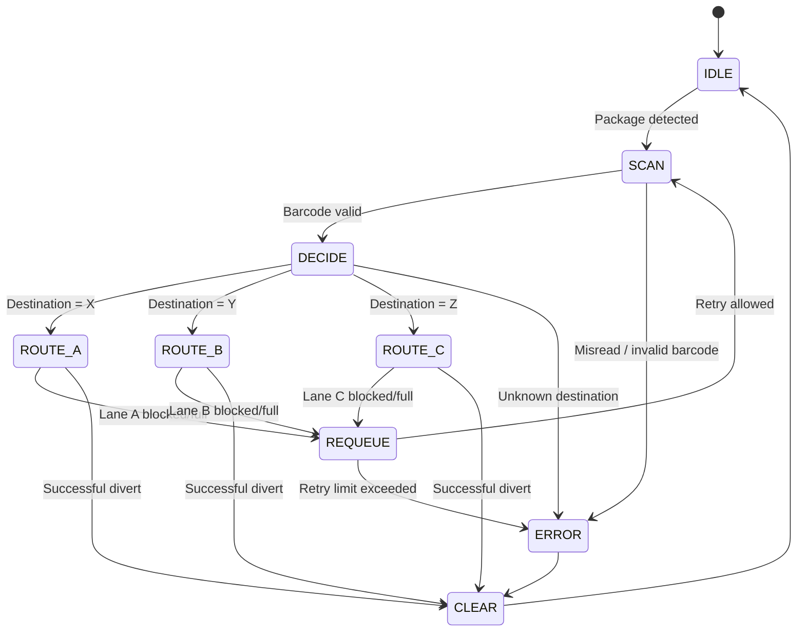

# PLC Design Notes for AutoSort Control System

## Overview

This project uses **Python to simulate a PLC-driven sortation line**. The logic mirrors a scan-based industrial control loop:

1. Detect a package at the infeed sensor
2. Read the barcode / destination
3. Determine the correct lane
4. Check downstream constraints
5. Energize the correct diverter output
6. Handle faults and retry logic

---

## Control objective

Route each package to its correct outbound lane:

- `X -> Lane A`
- `Y -> Lane B`
- `Z -> Lane C`
- anything unreadable or invalid -> **Exception / fault lane**

---

## PLC-style state machine



---

## Suggested PLC I/O mapping

### Inputs

| Tag | Type | Meaning |
|---|---|---|
| `I0.0` | Digital | Infeed photoeye detects a package |
| `I0.1` | Digital | Barcode scanner read complete |
| `I0.2` | Digital | Lane A blocked sensor |
| `I0.3` | Digital | Lane B blocked sensor |
| `I0.4` | Digital | Lane C blocked sensor |
| `I0.5` | Digital | Emergency stop |

### Outputs

| Tag | Type | Meaning |
|---|---|---|
| `Q0.0` | Digital | Conveyor run command |
| `Q0.1` | Digital | Diverter to Lane A |
| `Q0.2` | Digital | Diverter to Lane B |
| `Q0.3` | Digital | Diverter to Lane C |
| `Q0.4` | Digital | Fault beacon / alarm |

### Internal bits / memory words

| Tag | Type | Meaning |
|---|---|---|
| `M0.0` | Bit | System ready |
| `M0.1` | Bit | Scan valid |
| `M0.2` | Bit | Misread fault |
| `M0.3` | Bit | Queue buildup condition |
| `M1.0` | Bit | Route request A |
| `M1.1` | Bit | Route request B |
| `M1.2` | Bit | Route request C |
| `D10` | Word | Retry counter |
| `D20` | Word | Inbound queue count |

---

## Ladder-style pseudo logic

### Rung 1: Conveyor enable
```text
IF system_ready AND NOT emergency_stop THEN conveyor_run = ON
```

### Rung 2: Barcode validation
```text
IF package_present AND scan_complete THEN
    IF destination in {X, Y, Z}
        scan_valid = TRUE
    ELSE
        misread_fault = TRUE
```

### Rung 3: Lane decision
```text
IF scan_valid AND destination = X THEN route_request_A = TRUE
IF scan_valid AND destination = Y THEN route_request_B = TRUE
IF scan_valid AND destination = Z THEN route_request_C = TRUE
```

### Rung 4: Constraint handling
```text
IF route_request_A AND lane_A_blocked THEN requeue_package
IF route_request_B AND lane_B_blocked THEN requeue_package
IF route_request_C AND lane_C_blocked THEN requeue_package

IF retry_counter > retry_limit THEN send_to_exception_lane
```

### Rung 5: Fault output
```text
IF misread_fault OR overflow_fault OR blocked_lane_fault THEN alarm_beacon = ON
```

---

## Fault scenarios covered in the simulator

1. **Misread barcode**
   - unreadable input or invalid destination
   - package diverts to exception handling

2. **Blocked lane / conveyor jam**
   - downstream lane is unavailable
   - package is requeued up to a retry limit

3. **Lane overflow**
   - lane buffer is already full
   - package is requeued or faulted

4. **Inbound overflow**
   - too many packages arrive at once
   - excess packages are diverted before scan

---

## Why this maps well to fulfillment-center automation

This simulation reflects core warehouse control concepts used in distribution and fulfillment systems:

- deterministic routing logic
- queue management and accumulation
- downstream blocking behavior
- exception handling
- operator intervention during jams
- KPI tracking for throughput and faults
